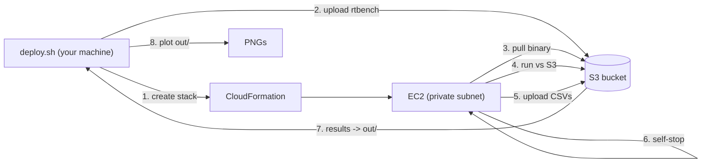

# Reproducing the README graphs on real S3

This directory runs the GlassDB benchmarks against a real Amazon S3 bucket on a
throwaway EC2 instance and reproduces the five figures in the top-level
[`README.md`](../../README.md):

| Figure                 | Benchmark              | Source CSV        |
| ---------------------- | ---------------------- | ----------------- |
| `tx-throughput.png`    | `rtbench` rw9010       | `throughput.csv`  |
| `tx-latency.png`       | `rtbench` rw9010       | `samples.csv`     |
| `ops-latency.png`      | `rtbench` rw9010       | `samples.csv`     |
| `retries.png`          | `rtbench` rw9010       | `stats.csv`       |
| `deadlock-latency.png` | `rtbench` deadlock     | `deadlock.csv`    |

Plus `client-stats.csv` (no figure): per-step client CPU / HTTP / connection
diagnostics, described under [Client-side diagnostics](#client-side-diagnostics-client-statscsv).

The rw9010 workload matches the README: 50k keys, 1..50 concurrent DBs, each
running 10 transactions in parallel (10% writes, 60% strong reads, 30% weak
reads). The deadlock workload runs 5 workers contending on 1..6 shared keys at
up to 100% overlap.

> The README graphs were originally taken on Google Cloud Storage. The same
> `rtbench` runs against S3 here; absolute numbers differ with backend
> latencies but the qualitative shape (near-linear throughput scaling, the
> retry-driven tail at high concurrency) is reproduced.

### Client-side diagnostics (`client-stats.csv`)

The rw9010 run also writes `client-stats.csv`: one row per concurrency step with
the wall time, process CPU time and utilization (as a percentage of all cores),
the number of S3 HTTP attempts (including retries), how many of those were
throttling responses (503/429), the number of new connections opened, and the
peak goroutine count. Because every DB in `rtbench` shares a single S3 client in
one process, this is what tells a *client-side* ceiling (CPU saturation,
connection churn) apart from *backend* throttling. The same numbers are logged
live per step (`clientmetrics num-db=...`), so they show up in `deploy.sh logs`.

## How it works

`cloudformation.yaml` provisions a **dedicated VPC with a private subnet and no
internet access** (no Internet Gateway, no NAT Gateway):

- S3 is reached through a **gateway VPC endpoint** (free).
- Shell access is through **SSM Session Manager** via `ssm` / `ssmmessages` /
  `ec2messages` interface endpoints; the `ec2` interface endpoint lets the
  instance stop itself.
- The instance has **no public IP and no inbound rules**.

Because there is no path to the internet, the instance cannot download Go or
clone the repo. Instead `deploy.sh` cross-compiles a static `rtbench` binary and
uploads it to the bucket; the instance pulls it over the gateway endpoint, runs
the benchmarks, uploads the CSVs to `results/<timestamp>/`, and then stops
itself.



## Prerequisites

- AWS credentials with permission to create VPC/EC2/IAM/S3 resources.
- The AWS CLI v2 and Go (matching `go.mod`) on your machine.
- [`uv`](https://docs.astral.sh/uv/) for the plotting script.

## Run it

```bash
# 1. Build the binary, create the stack, upload the binary.
export AWS_REGION=us-east-1            # pick a region close to you
./hack/aws-bench/deploy.sh deploy

# 2. Watch the run live (optional). Streams the bootstrap + rtbench log over
#    SSM until you Ctrl-C; -F waits for the file if the box is still booting.
./hack/aws-bench/deploy.sh logs

# 4. Wait ~15-20 min. The instance stops itself when finished. Download the
#    latest run's CSVs into hack/aws-bench/out/ with (the large samples.csv is
#    compressed to samples.csv.xz on the way in, if xz is installed):
./hack/aws-bench/deploy.sh results

# 5. Render the five PNGs from the downloaded CSVs (reads/writes out/ by default).
uv run hack/aws-bench/plot.py

# To overwrite the committed figures in docs/img as well, add --write-docs.

# 6. Tear everything down (empties the bucket, then deletes the stack).
./hack/aws-bench/deploy.sh teardown
```

### Streaming the logs

The bootstrap redirects everything (the binary-poll loop and all `rtbench`
output) to `/var/log/rtbench-bootstrap.log`, which grows live. Since the
instance has no public IP, stream it over SSM:

```bash
# Convenience wrapper (resolves the instance id from the stack):
./hack/aws-bench/deploy.sh logs

# ...which is equivalent to:
aws ssm start-session --target <instance-id> \
  --document-name AWS-StartInteractiveCommand \
  --parameters command="sudo tail -n +1 -F /var/log/rtbench-bootstrap.log"
```

This requires the [Session Manager
plugin](https://docs.aws.amazon.com/systems-manager/latest/userguide/session-manager-working-with-install-plugin.html)
locally. For a full interactive shell instead, use the `SsmSessionCommand` from
the stack outputs. The same log is also uploaded to
`s3://<bucket>/results/<timestamp>/bootstrap.log` at the end of the run.

### Tuning

`deploy.sh` reads these environment variables (see the script header for the
full list):

| Variable            | Default        | Meaning                                |
| ------------------- | -------------- | -------------------------------------- |
| `INSTANCE_TYPE`     | `c7i.8xlarge`  | EC2 instance type (must be x86_64)     |
| `MAX_DBS`           | `50`           | rw9010 max concurrent DBs              |
| `NUM_KEYS`          | `50000`        | rw9010 key count                       |
| `RUN_DURATION`      | `60s`          | rw9010 duration per concurrency step   |
| `DEADLOCK_DURATION` | `20s`          | deadlock duration per configuration    |
| `AUTO_STOP`         | `true`         | stop the instance when finished        |

### Instance sizing

`rtbench` runs every DB in one process against a single shared S3 client. The
throughput plateau (~10k S3 ops/s, ~2.8k tx/s past ~150-200 concurrent
transactions) is **not** a client-resource limit: a 48-vCPU `c7i.12xlarge` run
peaked at only **~13% CPU** with zero S3 throttling, and read latency stayed flat
while write latency inflated. The bottleneck is the write-commit path — each
write stamps lock tags via `SetTagsIf`, which on S3 is a GET+PUT (no
metadata-only update), and a commit is several sequential round-trips that grow
under lock contention. Bigger instances don't move it.

So size for headroom, not throughput: the sweep needs only ~6 vCPUs of actual
work. The default `c7i.8xlarge` (32 vCPUs) sits at ~20% CPU with room for bursts.
`c7i.2xlarge` (8 vCPUs) is enough for a cheap run but turns CPU-bound near 200
concurrent transactions, which masks the real ceiling.

For a cheap smoke test, scale everything down, e.g.
`MAX_DBS=5 NUM_KEYS=500 RUN_DURATION=10s ./hack/aws-bench/deploy.sh deploy`.

## Plotting from a different directory

`plot.py` always reads local CSVs and defaults to `hack/aws-bench/out/`. If your
CSVs are elsewhere (for example from a local `-backend=memory` or `-backend=gcs`
run), point at the directory:

```bash
uv run hack/aws-bench/plot.py --input ./results-dir --out ./out
```

## Reproducing locally with the fake backend (no AWS)

The committed real-S3 CSVs in [`out/`](out/) can be reproduced locally with the
in-memory backend wrapped in simulated S3 latencies and a per-prefix request-rate
ceiling (see [ADR-004](../../docs/adr/004-fake-s3-backend-fidelity.md)). No AWS
access is required:

```bash
go build -o /tmp/rtbench ./hack/rtbench

# rw9010 + deadlock at the same scale as the real run, into out-fake/.
/tmp/rtbench -backend=memory -delays=s3 -test-name=rw9010 \
  -max-dbs=50 -num-keys=50000 -duration=60s \
  -samples-out=hack/aws-bench/out-fake/samples.csv \
  -stats-out=hack/aws-bench/out-fake/stats.csv \
  -throughput-out=hack/aws-bench/out-fake/throughput.csv
/tmp/rtbench -backend=memory -delays=s3 -test-name=deadlock \
  -duration=20s -deadlock-out=hack/aws-bench/out-fake/deadlock.csv

# Compare fake vs real: prints per-concurrency fake/real ratios for throughput,
# retries and deadlock p50/p90, and writes overlay PNGs into out-fake/.
uv run hack/aws-bench/compare.py
```

For quick iteration, scale down (e.g. `-max-dbs=5 -num-keys=500 -duration=10s`).
`out-fake/` CSVs and plots are generated locally and not committed.

## Cost & cleanup

This uses **real S3** (storage + request charges for ~50k keys and the
benchmark traffic), an EC2 instance for the run, and **four interface VPC
endpoints billed per hour while the stack exists**. Always run
`deploy.sh teardown` when done. Auto-stop halts compute charges, but the
endpoints and stored objects keep costing until the stack is deleted.

`teardown` empties the bucket before deleting the stack (CloudFormation will not
delete a non-empty bucket) with `aws s3 rm --recursive`.
