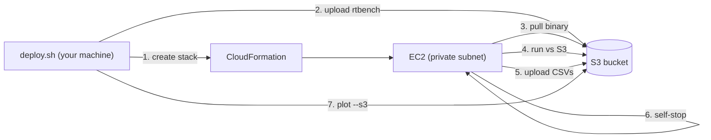

# Reproducing the README graphs on real S3

This directory runs the GlassDB benchmarks against a real Amazon S3 bucket on a
throwaway EC2 instance and reproduces the five figures in the top-level
[`README.md`](../../README.md):

| Figure                 | Benchmark              | Source CSV        |
| ---------------------- | ---------------------- | ----------------- |
| `tx-throughput.png`    | `rtbench` rw9010       | `throughput.csv`  |
| `tx-latency.png`       | `rtbench` rw9010       | `samples.csv`     |
| `ops-latency.png`      | `rtbench` rw9010       | `samples.csv`     |
| `retries.png`          | `rtbench` rw9010       | `stats.csv`       |
| `deadlock-latency.png` | `rtbench` deadlock     | `deadlock.csv`    |

The rw9010 workload matches the README: 50k keys, 1..50 concurrent DBs, each
running 10 transactions in parallel (10% writes, 60% strong reads, 30% weak
reads). The deadlock workload runs 5 workers contending on 1..6 shared keys at
up to 100% overlap.

> The README graphs were originally taken on Google Cloud Storage. The same
> `rtbench` runs against S3 here; absolute numbers differ with backend
> latencies but the qualitative shape (near-linear throughput scaling, the
> retry-driven tail at high concurrency) is reproduced.

## How it works

`cloudformation.yaml` provisions a **dedicated VPC with a private subnet and no
internet access** (no Internet Gateway, no NAT Gateway):

- S3 is reached through a **gateway VPC endpoint** (free).
- Shell access is through **SSM Session Manager** via `ssm` / `ssmmessages` /
  `ec2messages` interface endpoints; the `ec2` interface endpoint lets the
  instance stop itself.
- The instance has **no public IP and no inbound rules**.

Because there is no path to the internet, the instance cannot download Go or
clone the repo. Instead `deploy.sh` cross-compiles a static `rtbench` binary and
uploads it to the bucket; the instance pulls it over the gateway endpoint, runs
the benchmarks, uploads the CSVs to `results/<timestamp>/`, and then stops
itself.



## Prerequisites

- AWS credentials with permission to create VPC/EC2/IAM/S3 resources.
- The AWS CLI v2 and Go (matching `go.mod`) on your machine.
- [`uv`](https://docs.astral.sh/uv/) for the plotting script.

## Run it

```bash
# 1. Build the binary, create the stack, upload the binary.
export AWS_REGION=us-east-1            # pick a region close to you
./hack/aws-bench/deploy.sh deploy

# 2. Wait ~15-20 min. The instance stops itself when finished; results land in
#    s3://<bucket>/results/<timestamp>/. List them with:
./hack/aws-bench/deploy.sh results

# 3. Render the five PNGs from the latest results.
uv run hack/aws-bench/plot.py \
  --s3 s3://<bucket>/results/<timestamp> \
  --out hack/aws-bench/out

# To overwrite the committed figures in docs/img as well, add --write-docs.

# 4. Tear everything down (empties the bucket, then deletes the stack).
./hack/aws-bench/deploy.sh teardown
```

### Tuning

`deploy.sh` reads these environment variables (see the script header for the
full list):

| Variable            | Default       | Meaning                                |
| ------------------- | ------------- | -------------------------------------- |
| `INSTANCE_TYPE`     | `c7i.2xlarge` | EC2 instance type (must be x86_64)     |
| `MAX_DBS`           | `50`          | rw9010 max concurrent DBs              |
| `NUM_KEYS`          | `50000`       | rw9010 key count                       |
| `RUN_DURATION`      | `60s`         | rw9010 duration per concurrency step   |
| `DEADLOCK_DURATION` | `20s`         | deadlock duration per configuration    |
| `AUTO_STOP`         | `true`        | stop the instance when finished        |

For a cheap smoke test, scale everything down, e.g.
`MAX_DBS=5 NUM_KEYS=500 RUN_DURATION=10s ./hack/aws-bench/deploy.sh deploy`.

## Plotting from local CSVs

If you already have the CSVs locally (for example from a `-backend=memory` or
`-backend=gcs` run), skip `--s3` and point at the directory:

```bash
uv run hack/aws-bench/plot.py --input ./results-dir --out ./out
```

## Cost & cleanup

This uses **real S3** (storage + request charges for ~50k keys and the
benchmark traffic), an EC2 instance for the run, and **four interface VPC
endpoints billed per hour while the stack exists**. Always run
`deploy.sh teardown` when done. Auto-stop halts compute charges, but the
endpoints and stored objects keep costing until the stack is deleted.
